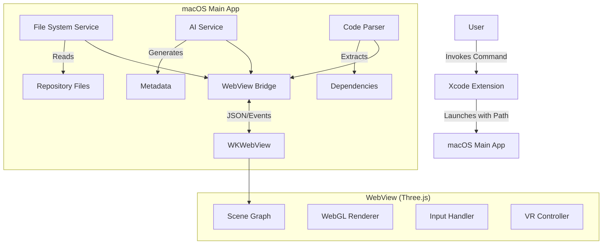

# Architecture Design: RepoVerse

## 1. High-Level Overview
The system consists of two main parts:
1.  **Xcode Source Editor Extension**: A lightweight entry point integrated into Xcode.
2.  **Standalone macOS Application**: The core application that hosts the visualization engine and performs heavy processing.

The separation is necessary because Xcode Extensions are sandboxed and lack the UI capabilities to host a full 3D engine like Three.js comfortably.

## 2. Component Diagram



## 3. Data Flow

1.  **Initialization**:
    *   The Main App receives the repository root path.
    *   `File System Service` traverses the directory, respecting `.gitignore`.
    *   A tree data structure (`FileNode`) is built in Swift.

2.  **Analysis**:
    *   `Code Parser` scans files for imports/usage to build an adjacency list of dependencies.
    *   `AI Service` (background thread) fetches summaries for nodes.

3.  **Rendering**:
    *   The Swift App serializes the `FileNode` tree and Dependency list into JSON.
    *   This JSON is injected into the `WKWebView` via `evaluateJavaScript`.
    *   The Three.js `GraphBuilder` parses the JSON and instantiates 3D meshes.

4.  **Interaction**:
    *   User hovers a node in 3D.
    *   JS sends an event to Swift (optional, if heavy data is needed) or displays a local tooltip.
    *   User clicks a node. JS sends `nodeSelected` message to Swift, which might open the file in the editor or show details in a side panel.

## 4. Technology Stack Details

### Backend (Swift)
-   **Language**: Swift 5.9+ (Modern Concurrency).
-   **UI Framework**: SwiftUI (macOS 14+ Target).
-   **WebView**: `WKWebView` (WebKit).
-   **Networking**: `URLSession` for AI API calls.
-   **Build System**: Swift Package Manager (`Package.swift`) for modules, Xcode for final app assembly.

### Frontend (Web/Three.js)
-   **Language**: TypeScript 5.0+.
-   **Library**: Three.js (r150+).
-   **Bundler**: Vite (latest).
-   **Text**: `Troika-Three-Text` or HTML overlays for labels.
-   **Controls**: `OrbitControls`, `FlyControls`.
-   **VR**: `WebXR` (via Three.js capabilities, limited by WebView support, falling back to simulated VR camera if needed).

## 5. Data Structures

### FileNode (Swift/JSON)
```json
{
  "id": "unique_path_hash",
  "name": "FileName.swift",
  "type": "file|folder",
  "path": "/path/to/file",
  "metadata": {
    "summary": "Handles user authentication",
    "loc": 120
  },
  "children": [],
  "dependencies": ["hash_of_dependency"]
}
```

## 6. Directory Structure
```
RepoVerse/
├── App/                # Main macOS App
│   ├── Sources/
│   │   ├── Services/   # File, AI, Parsing services
│   │   ├── ViewModels/
│   │   └── Views/      # SwiftUI Views
│   └── Resources/      # Assets (including bundled Web/dist)
├── Extension/          # Xcode Source Editor Extension
│   └── SourceEditorExtension.swift
├── Web/                # Frontend Code
│   ├── src/
│   │   ├── main.ts
│   │   └── scene.ts
│   ├── vite.config.ts
│   └── package.json
└── Shared/             # Shared data models (Swift Package)
```
